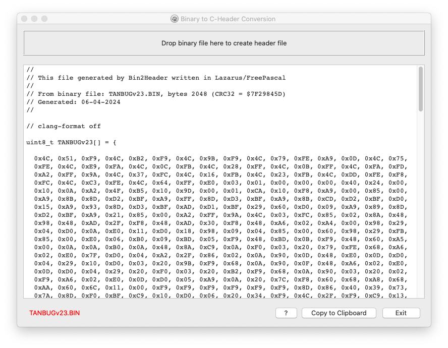

# Binary to C/C++ Header conversion

Whilst trying to make my Neo6502 emulate a Microtan 65 there were several occasions where I needed to have one of the ROMs available as an array of bytes in C/C++. There were quite options a few available, but I like to be able to drag and drop rather than type into a command line, so I knocked this up in a couple of hours in Lazarus / Free Pascal.

It accepts a single file dropped onto the form, then converts it into a character array in C/C++ header format. User can copy to clipboard to paste into their source files. It also calculates CRC32 for the file.

